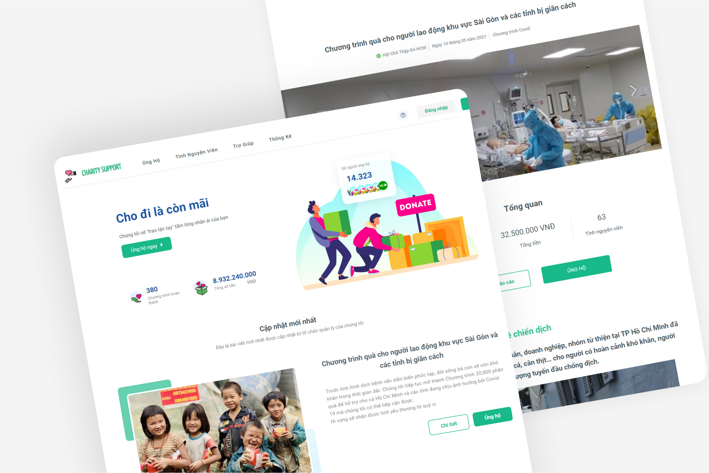
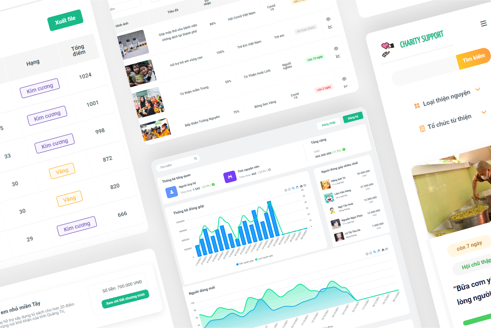

# Charity Support

  

  

# Main features

Charity Support is a website that helps users easily donate for charity program on pc, mobile device with transparent and clear statistical information. It also help organization manage their program

## User

- Search program charity
- Donate
- Follow their donated program
- Dashboard for charity program

## Admin

- Dashboard
- Manager charity program, organization, voluteer
- Analysic revenue, system status,...
- Create program, manage volunteer,...

# Tech stack

- Front end : ReactJS, TailwindCSS, CSS, SCSS, JS

# Demo

- Visit website: https://charitysupport.netlify.app/

# Contact

Contact me at this email: lamvanhongvn@gmail.com. Thank you!!
